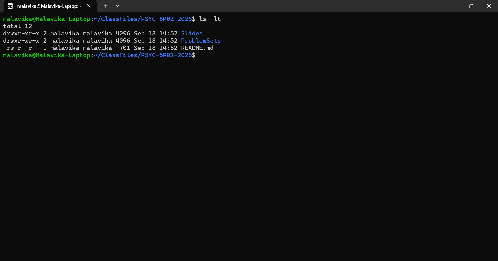

# PSYC 5P02 - Problem Set #1 Answers

#### Answer 1
 
(a) `ls -rt`,

where `ls` is the command used to list all the files in the current working directory, `-r` is the argument that lists the files in reverse order of whatever sorting method is being used, and `-t` is the argument that sorts by modification time (newest first)

(b) `ls -lrt`, 

a modification of the above command so that it includes the argument `-l` which lists the files in *long* format, with details about file permissions, owners, size and modification date.

(c) `-ls`: list directory contents, 
`-l`: use a long listing format,
`-r`: reverse order while sorting

#### Answer 2

Variants of the `cd` command (used to change directory to one specified by the user) can be used to navigate from the given current working directory (specified here as `/users/yourname/documents/`) to the home directory (specified here as `/users/yourname/`)
- `cd ~/` which places us in the home directory irrespective of our current working directory
- `cd ../` which places us in the directory above our current working directory, which in this case happens to be the home directory
- `cd '/users/yourname/'` which places us directly in the specified directory (in this case, the home directory)

#### Answer 3
1. `mkdir Data`: creates a directory called Data in the current working directory
2. `touch subj01.txt`: creates a text file with the given name in the current working directory
3. `cp subj01.txt subj02.txt` 
`cp subj01.txt subj03.txt`
`cp subj01.txt subj04.txt` 
`cp subj01.txt subj05.txt`
`cp subj01.txt subj11.txt`:
copies from source to destination file as specified (with format `cp [source] [destination]`)
4. `mv subj*.txt Data`: moves all files in current working directory with filenames which match the specified format (i.e., all filenames starting with 'subj' and ending with the .txt extension, where `*` is a wildcard character standing in for any string) to the destination directory (here, specified as Data)
5. `cd Data`: shifts current working directory to Data,
`rm subj0*.txt`: removes all files in current working directory with filenames which match the specified format (i.e., all filenames starting with 'subj0' and ending with the .txt extension)

#### Answer 4

`ls -dlt */ | tee ClassFileFolders.txt`

Although there are operators such as `>` and `>>` that redirect standard input into an existing or new file, the utility of `tee` lies in the fact that it can redirect standard input to both standard output and to a specified file.

Hence, in the above line of code, `ls -dlt */` will list all the subdirectories in the current working directory.

Here, `-dlt` indicates that only directories need to be listed, in long form and order of last time modified, and `*/` indicates that sub-directors must also be listed.

`tee ClassFileFolders.txt` stores the output from `ls -dlt */` (since it pipes from the same with the `|` operator) into a new file ClassFileFolders.txt

#### Answer 5

Both versions of command history include all the commands used upto the latest run instance of the shell. The files diverge when it comes to which commands from the current running instance were recorded.

When command history is recorded within the screen (as in the file 'command_history_inScreen.txt'), the up-to-date history includes all the commands that were executed within the screen, but not outside of the screen.

When command history is recorded outside of the screen (as in the file 'command_history_outScreen.txt'), the up-to-date history includes all the commands that were executed outside the screen, but not within the screen.

#### Answer 6

#### Answer 7

#### Answer 8
`history | tail -n 5 > githistory.txt`

Using the `tail` command with a pipe from the `history` command, with its options set to display 5 lines, the output was written into the 'githistory.txt' file.

Had to clear the history during my first attempt because I kept checking the history and adding several commands in between those used for git. I also started committing my files to both the remote and local versions of the git repository pretty early on, so you can see all the commits in my github repository as well.
